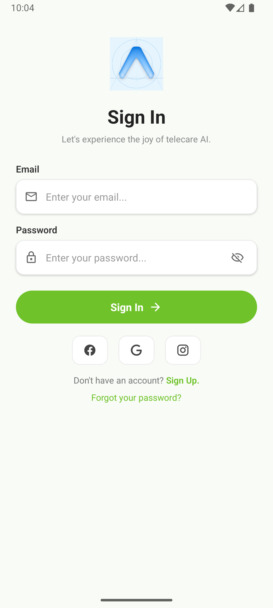

# Auth Screen Project

Recreated a Dribbble-inspired mobile authentication UI using React Native and Expo, implemented with only core React Native components.

## Screenshot



## Live Design Reference

Original design: https://dribbble.com/shots/24783022-osler-AI-Telehealth-Telemedicine-App-Sign-In-Sign-Up-UI

## Features

- App logo section
- Heading and subheading
- Email input field with icon
- Password input field with icon and visibility toggle
- Primary Sign In button
- Social login buttons (visual only)
- Sign up and Forgot password actions

## Tech

- Expo
- React Native (core components only)
- @expo/vector-icons (icons)

## Setup

Requirements: Node.js, npm or Yarn, Expo CLI (optional).

Install dependencies:

```bash
npm install
# or
yarn
```

Start the dev server:

```bash
npx expo start
# or
yarn start
```

Open the project in the Expo Go app (scan QR) or run in an iOS/Android simulator.

## Notes on Implementation

- The main screen is implemented at [app/index.tsx](app/index.tsx).
- The UI uses only core React Native components (no UI libraries like React Native Paper).
- Icons are provided by `@expo/vector-icons` for visual parity with the design.
- Layout aims to be responsive to typical mobile screen widths; tweak `styles` in `app/index.tsx` for additional adjustments.

## Project Structure

- `app/index.tsx` — Sign-in screen implementation
- `assets/` — images and static assets (add screenshot here)
- `package.json`, `app.json`, `tsconfig.json` — project config

## Submission

1. Push the repository to a public GitHub repo.
2. Add the app screenshot to `assets/screenshot.png` and commit.
3. In your submission, include the GitHub repo URL and a short note about any deviations from the design.

## Author

Auth Screen recreation — created for the cohort assignment.
